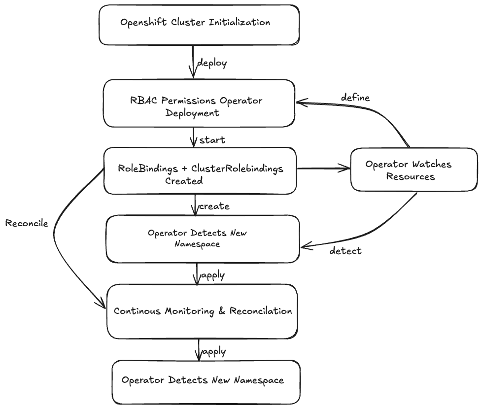

# RBAC Permissions Operator

[](https://goreportcard.com/report/github.com/openshift/rbac-permissions-operator)
[](https://codecov.io/gh/openshift/rbac-permissions-operator)
[](https://pkg.go.dev/mod/github.com/openshift/rbac-permissions-operator)
[](http://www.apache.org/licenses/LICENSE-2.0.html)

## Summary
The RBAC-Permissions-Operator was created for the Openshift Dedicated platform to manage various permissions (via k8s RBAC policies) to
all the projects/namespaces within an OpenShift Dedicated cluster. The permissions must allow for cluster and namespace scope access
and the ability to safe list and/or blocklist namespaces.

It contains the following components:
* Namespace controller: watches for new namespaces and guarantees that the proper RoleBindings are assigned to them.
* SubjectPermission controller: watches for subject permission changes and creates ClusterRoleBindings and RoleBindings as needed.

To avoid giving admin permissions to specific namespaces (eg. infra/cluster-admin related), two regex are implemented in the
form of NamespacesAllowedRegex and NamespacesDeniedRegex. These will help us determine which namespaces should get
the RoleBinding assignment.


## Metrics

## Testing, Locally (CRC)
To test a new version of the operator locally using CRC you need to:

1. start CRC
1. run `make predeploy`
1. on a separate terminal run `make deploy-local`
1. apply any valid CR and watch for log changes

# Controllers

## Namespace Controller

Watch for the creation of new `Namespaces` that passes through NamespacesAllowedRegex and NamespacesDeniedRegex. When discovered
create `RoleBindings` in that namespace to the corresponding subject.

## SubjectPermission Controller

The subjectpermission-controller is triggered by a new SubjectPermission CR or a change to an existing SubjectPermission CR. It is
responsible for the creation of `ClusterRoleBinding` and `Rolebinding`. It looks at the `subjectName` and the `clusterRoleName` passed
in by the SubjectPermission CR. If corresponding `ClusterRoleBinding` and/or `RoleBinding` do not exist then create them.

# Custom Resources

## SubjectPermission CR

The SubjectPermission CR holds the `SubjectKind`, `SubjectName`, `clusterPermissions`, and `permissions` needed to configure the rbac policies needed for any given subject. All configurations can be found at [managed-cluster-config](https://github.com/openshift/managed-cluster-config/tree/master/deploy/rbac-permissions-operator-config "rbac-permissions-operator-config")

```yaml
apiVersion: managed.openshift.io/v1alpha1
kind: SubjectPermission
metadata:
  name: dedicated-admins
  namespace: openshift-rbac-permissions
spec:
  subjectKind: Group
  subjectName: dedicated-admins
  clusterPermissions:
    - dedicated-admins-cluster
  permissions:
    -
      clusterRoleName: dedicated-admins-project
      namespacesAllowedRegex: ".*"
      namespacesDeniedRegex: "(^kube-.*|^openshift.*|^ops-health-monitoring$|^management-infra$|^default$|^logging$|^sre-app-check$)"
    -
      clusterRoleName: admin
      namespacesAllowedRegex: ".*"
      namespacesDeniedRegex: "(^kube-.*|^openshift.*|^ops-health-monitoring$|^management-infra$|^default$|^logging$|^sre-app-check$)"
```
# Workflow

